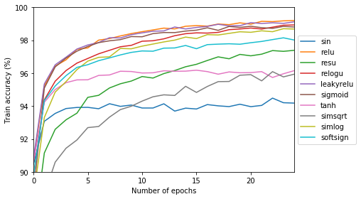
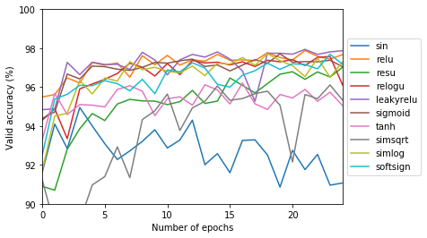

# Activation Functions

I tried to train a MLP on MNIST using various activation functions. These activation functions are :

* Sine
* Cosine
* LeakyTanh
* SimSqrt
* ReLU
* ReSU
* ReLogU

**See `main.ipynb` for the mathematical interpretation of these activation functions.** I am not able to render LaTeX equation in the README...

For all experiments, we used a two layer MLP with each hidden layer having 500 hidden units. We used the ADAM optimizer (Kingma & Ba, 2014) with a learning rate of 1e-3 and all other hyperparameters were the default ones from PyTorch. We used the Cross Entropy Loss criterion to train out model. We trained the model during 25 epochs.

Note that the results for the *Cos* activation function was not presented, because the results were almost identical to the ones obtained using *Sin*.

The evolution of the loss during the training is presented below:

The evolution of the training accuracy is presented below:

The evolution of the validation accuracy is presented below:

We see that the model using the *Sin* activation function doesn't achieve nearly the results obtained with the other activation functions, with results of around 94% on the training set and results between 92% and 94% on the validation set. We also note that the evolution of the performance on the validation set is really noisy compared to the other activations.

We also see that the models using square roots (*ReSU* and *SimSqrt*) learn far more slowly than the other ones. However, we note that *ReSU* has the potential to have the same accuracy on the validation set than the other more powerfull activations.

Finally, the best results were obtained using either the *ReLU*, *ReLogU*, *Leaky ReLU* or *Sigmoid* activation functions, while the *SimLog* and *SoftSign* activations we not far behind. 

It is important to note that both the *ReLU* and the *Leaky ReLU* are less computationally expensive than the other activation functions used and achieved the best results. We thus recommend the use of one or the other.

------------------------

### TODO
* Provide visualisation of the various activation functions
